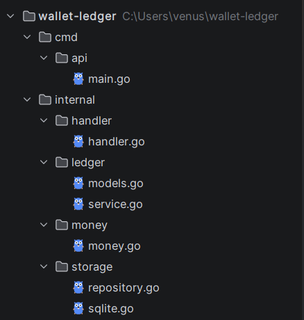
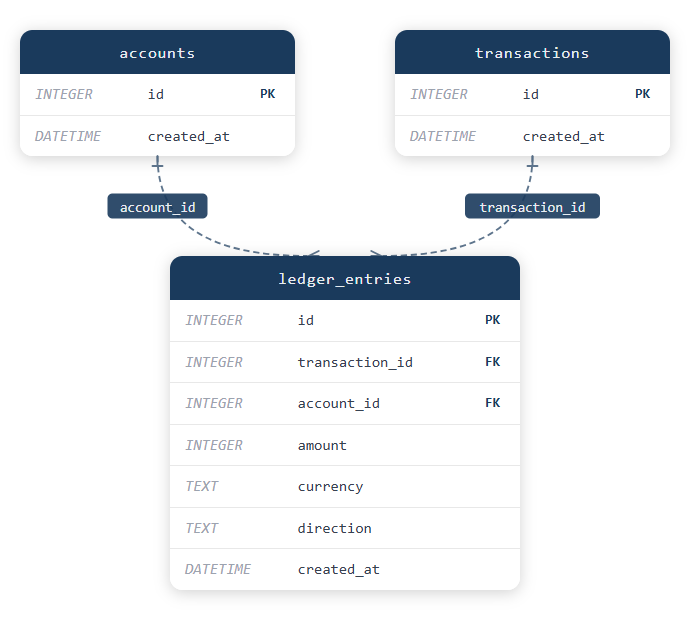

# Wallet Ledger Service

A small HTTP service for tracking and moving money across accounts, built with Go and SQLite.

---

## Why Go?

I chose Go for reasons directly relevant to what this assignment tests:

- **Concurrency correctness** — Go's `database/sql` connection pool and SQLite's WAL mode
  let me control transaction isolation at the driver level, which is where the
  "no double-charges under concurrent requests" requirement lives.
- **No framework needed** — Go 1.22's `net/http` natively supports method-scoped routing
  (`POST /accounts`, `GET /accounts/{id}/balance`) with zero dependencies,
  matching the assignment's "no framework required" spirit.
- **finally, I like compiled languages as it offers reliability** 

---

### Prerequisites
- Go 1.22+

### Run
```bash
git clone https://github.com/A7med-noureldin/wallet-ledger
cd wallet-ledger
go mod tidy
go run ./cmd/api/main.go
```

Server starts on `http://localhost:8080`.


---

## Testing API using Postman 

### Create Account
`POST /accounts`

```json
// 201 Created
{ "account_id": 1 }
```

---

### Deposit
`POST /accounts/{id}/deposits`

```json
// Request
{ "amount": 1000, "currency": "USD" }

// 204 No Content
```

| Status | Reason |
|--------|--------|
| `400`  | Unsupported currency |
| `400`  | Invalid account ID |
| `400`  | Invalid Json payload (when provide floating point amount)|

---

### Transfer
`POST /transfers`

```json
// Request
{
  "from_account": 1,
  "to_account": 2,
  "amount": 500,
  "currency": "EGP"
}

// 204 No Content
```

| Status | Reason |
|--------|--------|
| `422`  | Insufficient funds |
| `400`  | Unsupported currency |

---

### Get Balance
`GET /accounts/{id}/balance`

```json
// 200 OK
{ "EGP": 5000 }
```

---

### Get Transactions
`GET /accounts/{id}/transactions`

```json
// 200 OK
[
  {
    "id": 1,
    "account_id": 1,
    "amount": 10000,
    "currency": "USD",
    "type": "CREDIT",
    "created_at": "2026-06-23T13:09:21Z"
  }
]
```

Returns `[]` when there are no transactions.

---

## Correctness Guarantees

These are the core requirements of the assignment and how they're met:

| Requirement | Implementation |
|-------------|----------------|
| No money created or lost | Double-entry bookkeeping — every transfer debits one account and credits another in the same transaction |
| No double-charges | Transfer runs inside a single SQLite transaction with serialized writes |
| Concurrent safety | SQLite WAL mode + connection pool PRAGMA hooks ensure readers don't block writers and transactions don't interleave |
| No floating-point money | All amounts are `int64` minor units (piastres / cents) throughout — at the DB, service, and HTTP layers |
| Persistence | SQLite file-backed database, not in-memory |

---

## Project Structure


---

## Database Schema


---

